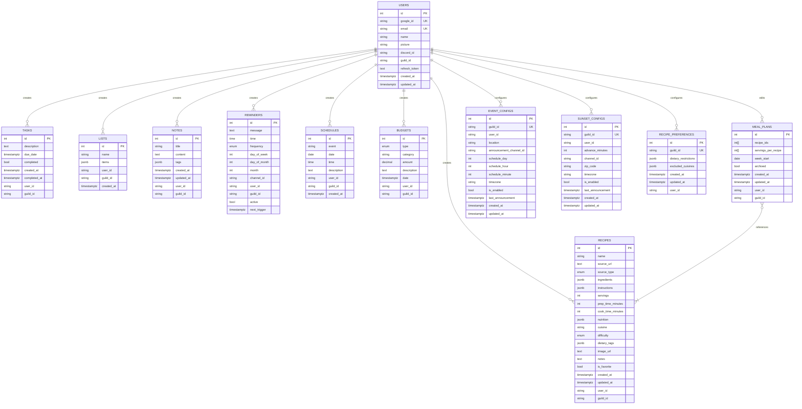

# Database Schema

**Version:** 2.1.2
**Last Updated:** 2026-04-15
**Database:** Supabase (managed PostgreSQL)
**Client:** `@supabase/supabase-js` via `supabase/supabase.ts`
**Authoritative Source:** `supabase/migrations/*.sql` (+ `supabase/init.sql` for bootstrap)

Complete database schema documentation for Bwaincell productivity platform.

---

## Overview

Bwaincell uses Supabase (managed PostgreSQL) for data persistence across Discord Bot, REST API, and PWA interfaces. The schema is applied via Supabase-managed migrations in `supabase/migrations/`. Data is shared per Discord guild (household model); `user_id` is retained for audit trails.

**Key Design Decisions:**

- **Supabase-managed migrations:** Schema changes live in `supabase/migrations/YYYYMMDDHHMMSS_description.sql`, applied with `supabase db push` / `supabase db reset`.
- **No Foreign Keys:** Schema currently uses application-level enforcement for easier multi-tenant flexibility. `user_id` / `guild_id` are strings (Discord snowflakes), not FKs to `users.id`.
- **Guild-Based Isolation:** Default filtering by `guild_id` for shared household access (WO-015).
- **Timestamp Tracking:** `created_at` / `updated_at` on most tables.
- **JSONB for Complex Data:** Lists, recipe ingredients/instructions/nutrition/tags, note tags use JSONB.
- **ENUM types:** `reminder_frequency`, `budget_type`, `recipe_difficulty`, `recipe_source_type`.

**Note on RLS:** Row Level Security policies are not defined in the current migrations (`20260413000000_initial_schema.sql`, `20260414000000_recipes_schema.sql`). The backend uses the Supabase **service role key** and enforces isolation in application code. Adding RLS policies is recommended if/when the frontend begins querying Supabase with the anon key directly. See [security-best-practices.md](../guides/security-best-practices.md).

---

## Entity-Relationship Diagram



---

## ENUM Types

Defined in migrations:

- `reminder_frequency` — `'once' | 'daily' | 'weekly' | 'monthly' | 'yearly'`
- `budget_type` — `'expense' | 'income'`
- `recipe_difficulty` — `'easy' | 'medium' | 'hard'`
- `recipe_source_type` — `'website' | 'video' | 'file' | 'manual'`

Extensions enabled: `uuid-ossp`, `pg_trgm`.

---

## Tables

### 1. users

Authenticated users (Google OAuth) with Discord-ID mapping.

| Column          | Type           | Constraints                 |
| --------------- | -------------- | --------------------------- |
| `id`            | `SERIAL`       | `PRIMARY KEY`               |
| `google_id`     | `VARCHAR(255)` | `NOT NULL`, `UNIQUE`        |
| `email`         | `VARCHAR(255)` | `NOT NULL`, `UNIQUE`        |
| `name`          | `VARCHAR(255)` | `NOT NULL`                  |
| `picture`       | `VARCHAR(255)` |                             |
| `discord_id`    | `VARCHAR(255)` | `NOT NULL`                  |
| `guild_id`      | `VARCHAR(255)` | `NOT NULL`                  |
| `refresh_token` | `TEXT`         |                             |
| `created_at`    | `TIMESTAMPTZ`  | `NOT NULL`, `DEFAULT NOW()` |
| `updated_at`    | `TIMESTAMPTZ`  | `NOT NULL`, `DEFAULT NOW()` |

**Indexes:** `idx_users_email`, `idx_users_google_id`.

### 2. tasks

| Column         | Type           | Constraints                 |
| -------------- | -------------- | --------------------------- |
| `id`           | `SERIAL`       | `PRIMARY KEY`               |
| `description`  | `TEXT`         | `NOT NULL`                  |
| `due_date`     | `TIMESTAMPTZ`  |                             |
| `completed`    | `BOOLEAN`      | `NOT NULL`, `DEFAULT FALSE` |
| `created_at`   | `TIMESTAMPTZ`  | `NOT NULL`, `DEFAULT NOW()` |
| `completed_at` | `TIMESTAMPTZ`  |                             |
| `user_id`      | `VARCHAR(255)` | `NOT NULL`                  |
| `guild_id`     | `VARCHAR(255)` | `NOT NULL`                  |

**Indexes:** `idx_tasks_guild_id`, `idx_tasks_completed`, `idx_tasks_guild_completed`.

### 3. notes

| Column       | Type           | Constraints                       |
| ------------ | -------------- | --------------------------------- |
| `id`         | `SERIAL`       | `PRIMARY KEY`                     |
| `title`      | `VARCHAR(255)` | `NOT NULL`                        |
| `content`    | `TEXT`         | `NOT NULL`                        |
| `tags`       | `JSONB`        | `NOT NULL`, `DEFAULT '[]'::jsonb` |
| `created_at` | `TIMESTAMPTZ`  | `NOT NULL`, `DEFAULT NOW()`       |
| `updated_at` | `TIMESTAMPTZ`  | `NOT NULL`, `DEFAULT NOW()`       |
| `user_id`    | `VARCHAR(255)` | `NOT NULL`                        |
| `guild_id`   | `VARCHAR(255)` | `NOT NULL`                        |

**Indexes:** `idx_notes_guild_id`.

### 4. lists

Items stored as JSONB array.

| Column       | Type           | Constraints                       |
| ------------ | -------------- | --------------------------------- |
| `id`         | `SERIAL`       | `PRIMARY KEY`                     |
| `name`       | `VARCHAR(255)` | `NOT NULL`                        |
| `items`      | `JSONB`        | `NOT NULL`, `DEFAULT '[]'::jsonb` |
| `user_id`    | `VARCHAR(255)` | `NOT NULL`                        |
| `guild_id`   | `VARCHAR(255)` | `NOT NULL`                        |
| `created_at` | `TIMESTAMPTZ`  | `NOT NULL`, `DEFAULT NOW()`       |

**Indexes:** `idx_lists_guild_id`.

### 5. reminders

| Column         | Type                 | Constraints                  |
| -------------- | -------------------- | ---------------------------- |
| `id`           | `SERIAL`             | `PRIMARY KEY`                |
| `message`      | `TEXT`               | `NOT NULL`                   |
| `time`         | `TIME`               | `NOT NULL`                   |
| `frequency`    | `reminder_frequency` | `NOT NULL`, `DEFAULT 'once'` |
| `day_of_week`  | `INTEGER`            |                              |
| `day_of_month` | `INTEGER`            |                              |
| `month`        | `INTEGER`            |                              |
| `channel_id`   | `VARCHAR(255)`       | `NOT NULL`                   |
| `user_id`      | `VARCHAR(255)`       | `NOT NULL`                   |
| `guild_id`     | `VARCHAR(255)`       | `NOT NULL`                   |
| `active`       | `BOOLEAN`            | `NOT NULL`, `DEFAULT TRUE`   |
| `next_trigger` | `TIMESTAMPTZ`        |                              |

**Indexes:** `idx_reminders_guild_id`, `idx_reminders_active`, `idx_reminders_next_trigger` (partial `WHERE active = TRUE`).

### 6. budgets

| Column        | Type            | Constraints                 |
| ------------- | --------------- | --------------------------- |
| `id`          | `SERIAL`        | `PRIMARY KEY`               |
| `type`        | `budget_type`   | `NOT NULL`                  |
| `category`    | `VARCHAR(255)`  |                             |
| `amount`      | `DECIMAL(10,2)` | `NOT NULL`                  |
| `description` | `TEXT`          |                             |
| `date`        | `TIMESTAMPTZ`   | `NOT NULL`, `DEFAULT NOW()` |
| `user_id`     | `VARCHAR(255)`  | `NOT NULL`                  |
| `guild_id`    | `VARCHAR(255)`  | `NOT NULL`                  |

**Indexes:** `idx_budgets_guild_id`, `idx_budgets_type`, `idx_budgets_date`.

### 7. schedules

| Column        | Type           | Constraints                 |
| ------------- | -------------- | --------------------------- |
| `id`          | `SERIAL`       | `PRIMARY KEY`               |
| `event`       | `VARCHAR(255)` | `NOT NULL`                  |
| `date`        | `DATE`         | `NOT NULL`                  |
| `time`        | `TIME`         | `NOT NULL`                  |
| `description` | `TEXT`         |                             |
| `user_id`     | `VARCHAR(255)` | `NOT NULL`                  |
| `guild_id`    | `VARCHAR(255)` | `NOT NULL`                  |
| `created_at`  | `TIMESTAMPTZ`  | `NOT NULL`, `DEFAULT NOW()` |

**Indexes:** `idx_schedules_guild_id`, `idx_schedules_date`.

### 8. event_configs

Per-guild local-events discovery + announcement scheduling.

| Column                    | Type           | Constraints                                 |
| ------------------------- | -------------- | ------------------------------------------- |
| `id`                      | `SERIAL`       | `PRIMARY KEY`                               |
| `guild_id`                | `VARCHAR(255)` | `NOT NULL`, `UNIQUE`                        |
| `user_id`                 | `VARCHAR(255)` | `NOT NULL`                                  |
| `location`                | `VARCHAR(255)` | `NOT NULL`                                  |
| `announcement_channel_id` | `VARCHAR(255)` | `NOT NULL`                                  |
| `schedule_day`            | `INTEGER`      | `NOT NULL`, `DEFAULT 1`                     |
| `schedule_hour`           | `INTEGER`      | `NOT NULL`, `DEFAULT 12`                    |
| `schedule_minute`         | `INTEGER`      | `NOT NULL`, `DEFAULT 0`                     |
| `timezone`                | `VARCHAR(255)` | `NOT NULL`, `DEFAULT 'America/Los_Angeles'` |
| `is_enabled`              | `BOOLEAN`      | `NOT NULL`, `DEFAULT TRUE`                  |
| `last_announcement`       | `TIMESTAMPTZ`  |                                             |
| `created_at`              | `TIMESTAMPTZ`  | `NOT NULL`, `DEFAULT NOW()`                 |
| `updated_at`              | `TIMESTAMPTZ`  | `NOT NULL`, `DEFAULT NOW()`                 |

**Indexes:** `idx_event_configs_is_enabled`.

### 9. sunset_configs

Per-guild sunset announcement settings.

| Column              | Type           | Constraints                                 |
| ------------------- | -------------- | ------------------------------------------- |
| `id`                | `SERIAL`       | `PRIMARY KEY`                               |
| `guild_id`          | `VARCHAR(255)` | `NOT NULL`, `UNIQUE`                        |
| `user_id`           | `VARCHAR(255)` | `NOT NULL`                                  |
| `advance_minutes`   | `INTEGER`      | `NOT NULL`, `DEFAULT 60`                    |
| `channel_id`        | `VARCHAR(255)` | `NOT NULL`                                  |
| `zip_code`          | `VARCHAR(255)` | `NOT NULL`                                  |
| `timezone`          | `VARCHAR(255)` | `NOT NULL`, `DEFAULT 'America/Los_Angeles'` |
| `is_enabled`        | `BOOLEAN`      | `NOT NULL`, `DEFAULT TRUE`                  |
| `last_announcement` | `TIMESTAMPTZ`  |                                             |
| `created_at`        | `TIMESTAMPTZ`  | `NOT NULL`, `DEFAULT NOW()`                 |
| `updated_at`        | `TIMESTAMPTZ`  | `NOT NULL`, `DEFAULT NOW()`                 |

**Indexes:** `idx_sunset_configs_is_enabled`.

### 10. recipes

Recipes are shared per guild (household-level access). `user_id` is an audit trail of who added it.

| Column              | Type                 | Constraints                                                              |
| ------------------- | -------------------- | ------------------------------------------------------------------------ |
| `id`                | `SERIAL`             | `PRIMARY KEY`                                                            |
| `name`              | `VARCHAR(255)`       | `NOT NULL`                                                               |
| `source_url`        | `TEXT`               |                                                                          |
| `source_type`       | `recipe_source_type` | `NOT NULL`, `DEFAULT 'manual'`                                           |
| `ingredients`       | `JSONB`              | `NOT NULL` — `[{ name, quantity, unit, category }]`                      |
| `instructions`      | `JSONB`              | `NOT NULL` — `string[]`                                                  |
| `servings`          | `INTEGER`            |                                                                          |
| `prep_time_minutes` | `INTEGER`            |                                                                          |
| `cook_time_minutes` | `INTEGER`            |                                                                          |
| `nutrition`         | `JSONB`              | `{ calories, protein, carbs, fat, fiber, sugar, sodium }`                |
| `cuisine`           | `VARCHAR(100)`       |                                                                          |
| `difficulty`        | `recipe_difficulty`  |                                                                          |
| `dietary_tags`      | `JSONB`              | `NOT NULL`, `DEFAULT '[]'::jsonb` — e.g. `["vegetarian", "gluten-free"]` |
| `image_url`         | `TEXT`               |                                                                          |
| `notes`             | `TEXT`               |                                                                          |
| `is_favorite`       | `BOOLEAN`            | `NOT NULL`, `DEFAULT FALSE`                                              |
| `created_at`        | `TIMESTAMPTZ`        | `NOT NULL`, `DEFAULT NOW()`                                              |
| `updated_at`        | `TIMESTAMPTZ`        | `NOT NULL`, `DEFAULT NOW()`                                              |
| `user_id`           | `VARCHAR(255)`       | `NOT NULL` (audit)                                                       |
| `guild_id`          | `VARCHAR(255)`       | `NOT NULL`                                                               |

**Indexes:** `idx_recipes_guild_id`, `idx_recipes_guild_favorite`, `idx_recipes_cuisine`, `idx_recipes_difficulty`.

### 11. meal_plans

Exactly one active plan per guild (partial unique index). `recipe_ids` and `servings_per_recipe` are parallel 7-element arrays.

| Column                | Type           | Constraints                     |
| --------------------- | -------------- | ------------------------------- |
| `id`                  | `SERIAL`       | `PRIMARY KEY`                   |
| `recipe_ids`          | `INTEGER[]`    | `NOT NULL` (length 7)           |
| `servings_per_recipe` | `INTEGER[]`    | `NOT NULL` (length 7, parallel) |
| `week_start`          | `DATE`         | `NOT NULL`                      |
| `archived`            | `BOOLEAN`      | `NOT NULL`, `DEFAULT FALSE`     |
| `created_at`          | `TIMESTAMPTZ`  | `NOT NULL`, `DEFAULT NOW()`     |
| `updated_at`          | `TIMESTAMPTZ`  | `NOT NULL`, `DEFAULT NOW()`     |
| `user_id`             | `VARCHAR(255)` | `NOT NULL` (audit)              |
| `guild_id`            | `VARCHAR(255)` | `NOT NULL`                      |

**Indexes:**

- `idx_meal_plans_guild_active` — `UNIQUE` on `(guild_id)` `WHERE archived = FALSE` (one active plan per guild)
- `idx_meal_plans_guild_archived` — `(guild_id, archived, created_at DESC)`

### 12. recipe_preferences

Per-guild recipe preferences.

| Column                 | Type           | Constraints                       |
| ---------------------- | -------------- | --------------------------------- |
| `id`                   | `SERIAL`       | `PRIMARY KEY`                     |
| `guild_id`             | `VARCHAR(255)` | `NOT NULL`, `UNIQUE`              |
| `dietary_restrictions` | `JSONB`        | `NOT NULL`, `DEFAULT '[]'::jsonb` |
| `excluded_cuisines`    | `JSONB`        | `NOT NULL`, `DEFAULT '[]'::jsonb` |
| `created_at`           | `TIMESTAMPTZ`  | `NOT NULL`, `DEFAULT NOW()`       |
| `updated_at`           | `TIMESTAMPTZ`  | `NOT NULL`, `DEFAULT NOW()`       |
| `user_id`              | `VARCHAR(255)` | `NOT NULL` (audit)                |

---

## Supabase Client

**File:** `supabase/supabase.ts`

Lazily initializes a `SupabaseClient` behind a `Proxy` so that importing the client does not force env-var resolution at module load time. Keys used:

- `SUPABASE_URL` (required)
- `SUPABASE_SERVICE_ROLE_KEY` (preferred; server-side) OR `SUPABASE_ANON_KEY` (fallback)

```typescript
import supabase from '../../supabase/supabase';

const { data, error } = await supabase
  .from('tasks')
  .select('*')
  .eq('guild_id', guildId)
  .order('created_at', { ascending: false });
```

`verifyConnection()` is invoked during bot startup to confirm reachability.

---

## Model Wrappers

Each table has a typed wrapper in `supabase/models/`:

- `User.ts`, `Task.ts`, `List.ts`, `Note.ts`, `Reminder.ts`, `Schedule.ts`, `Budget.ts`
- `EventConfig.ts`, `SunsetConfig.ts`
- `Recipe.ts`, `MealPlan.ts`, `RecipePreferences.ts`

These wrappers expose CRUD and domain-specific methods (e.g., `Task.getUserTasks`, `List.addItem`, `Reminder.calculateNextTrigger`, `MealPlan.getActiveForGuild`). They encapsulate all Supabase queries so Discord commands, Express routes, and Next.js API routes share a single data-access layer.

---

## Migration Workflow

**Author a new migration:**

```bash
supabase migration new <description>
# Creates supabase/migrations/YYYYMMDDHHMMSS_<description>.sql
```

**Apply:**

```bash
supabase db push      # apply to linked remote
supabase db reset     # local: wipe + re-run all migrations + seed
```

**File naming:** `YYYYMMDDHHMMSS_<description>.sql` — timestamps determine order.

See [guides/database-migrations.md](../guides/database-migrations.md).

---

## Indexes and Performance

1. **Guild-based queries:** every multi-tenant table has a `guild_id` index
2. **Status filters:** partial indexes on `active` / `completed` where relevant
3. **Date filters:** indexes on `date`, `next_trigger`, `due_date` columns
4. **Meal-plan uniqueness:** partial unique index enforces one active plan per guild
5. **`pg_trgm`** extension enabled for fuzzy matching / trigram search

---

## Data Isolation

### Guild-Based (Default)

```typescript
// supabase/models/Task.ts
export async function getGuildTasks(guildId: string) {
  const { data, error } = await supabase
    .from('tasks')
    .select('*')
    .eq('guild_id', guildId)
    .order('created_at', { ascending: false });
  if (error) throw error;
  return data;
}
```

### User-Scoped

Where per-user privacy is needed, add `.eq('user_id', userId)` to the filter chain.

---

## Backup and Restore

The self-hosted Supabase instance on the Pi handles its own PostgreSQL volumes. Recommended strategies:

- **Supabase Studio** — backup/restore UI
- **pg_dump / pg_restore** — standard PostgreSQL tools targeting the Supabase Postgres container
- **Scheduled cron** — `pg_dump` into an off-Pi location

---

## Related Documentation

- [Architecture Overview](overview.md)
- [Database Migrations Guide](../guides/database-migrations.md)
- [API Documentation](../api/)
- [Troubleshooting Guide](../guides/troubleshooting.md)

---

**Last Updated:** 2026-04-15
**Version:** 2.1.2
